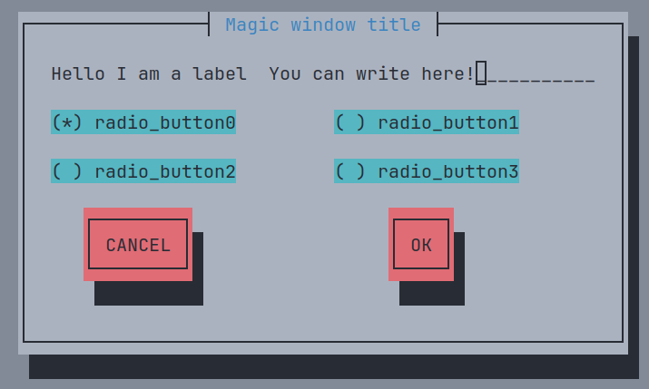
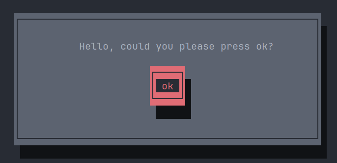

# newtpp

Newtpp is a header-only C++ library that builds on the functionality of the newt C library to help users create simple terminal user interfaces quickly and easily. The library adds type safety, utility to build UI faster, and support for RAII.

## Features

- *Type safety*: newtpp provides type-safe C++ wrappers around the newt C library functions, reducing the risk of errors caused by incorrect use of function parameters.
- *Utility*: newtpp provides a set of high-level C++ classes and functions that make it easier to build terminal UIs.
- *RAII support*: newtpp's classes use RAII (Resource Acquisition Is Initialization) to manage resources automatically, reducing the risk of resource leaks.

## Requirements

- A C++20 compiler
- The newt C library

## Getting started

To use newtpp, simply clone the repository and include the relevant header files in your C++ project:

`git clone https://github.com/GiuseppeCesarano/newtpp`

``` c++
#include "newtpp/newtpp.hpp"
```

when compiling link libnewt with `-lnewt` (clang++ or g++)

## Documentation

You can use the [examples](#examples) as a guide, or refer to the [docs](doc/doc.md) for the full class documentation.

## Examples

### Fastest way of creating ui

```c++
int main()
{
  newt::root_window::init(newt::theme::ONE_LIGHT);
  newt::root_window::push_default_help_line();

  newt::entrybox text_input { 30, { 0, 0 }, "You can write here!" };
  newt::label label { "Hello I am a label" };
  newt::radio_button_collection rb_collection { "radio_button0", "radio_button1", "radio_button2", "radio_button3" };
  rb_collection.set_current(0);
  newt::button confirm { "OK" };
  newt::button del { "CANCEL" };

  // Create and run form inside a window, organized with a grid of 2 cols and 4 rows
  const auto [EXIT_INFO, FORM] = newt::fast_run(2, 4,  "Magic window title", label, text_input, rb_collection, del, confirm);
  newt::root_window::finish();

  if (newt::exit_reason::COMPONENT == EXIT_INFO.reason) { // Check if a component caused the exit
    if (std::get<newt::component>(EXIT_INFO.data) == confirm) { // Check if it's confirm (OK) button 
      const auto TEXT = text_input.get_value();
      std::cout << TEXT << '\n'
                << rb_collection.get_current_index() << '\n';
    }
  }
}
```



### Simple ui with manual positioning

```c++
int main()
{
  newt::root_window::init();

  /* Positioning is relative to the last window created *
   * in win costructor it's relative to the root window */
  newt::window win { newt::usize { 50, 8 } }; 

  // Now is relative to win
  newt::label text { "Hello, could you please press ok?", { 10, 1 } };
  newt::button ok_button { "ok", { 22, 3 } };

  newt::form simple_message { text, ok_button };

  simple_message.run();

  newt::root_window::finish();
}
```



**TODO:** add more examples
